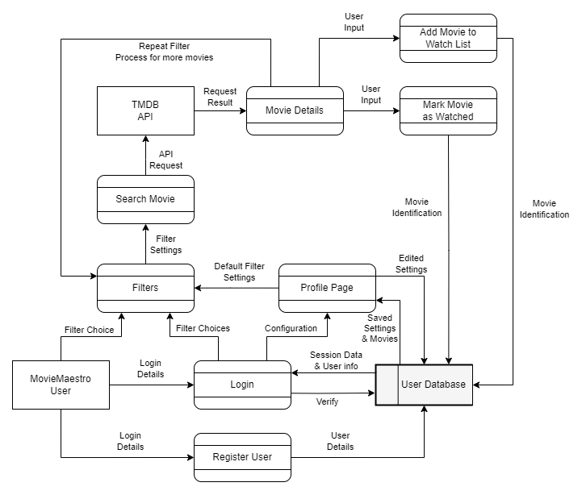
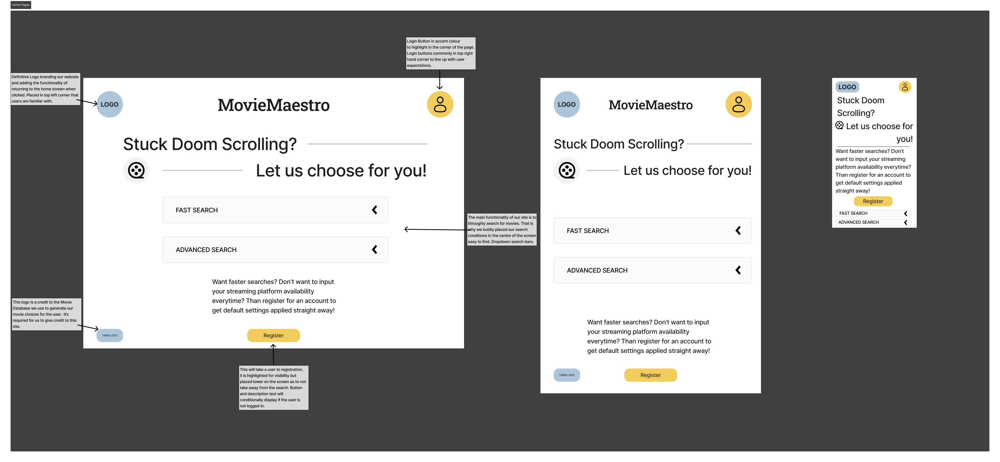
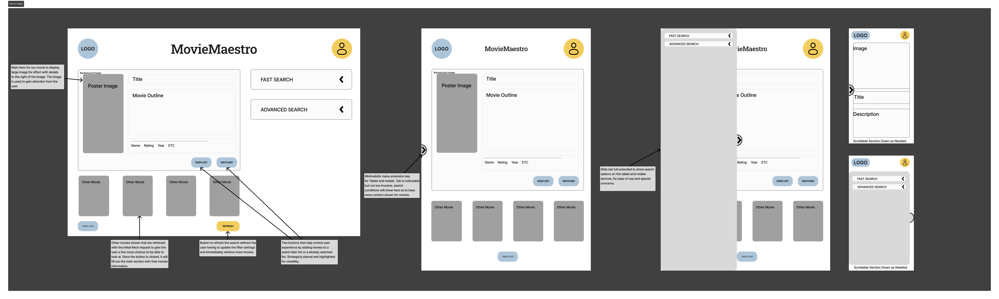
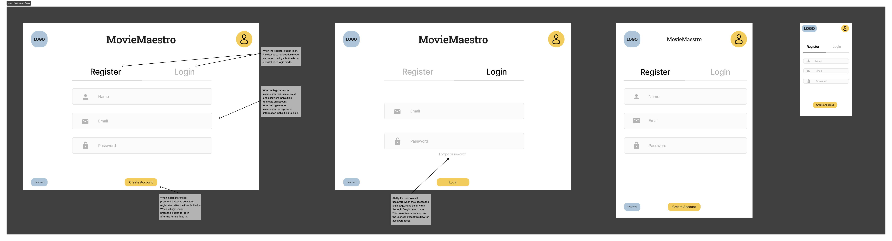
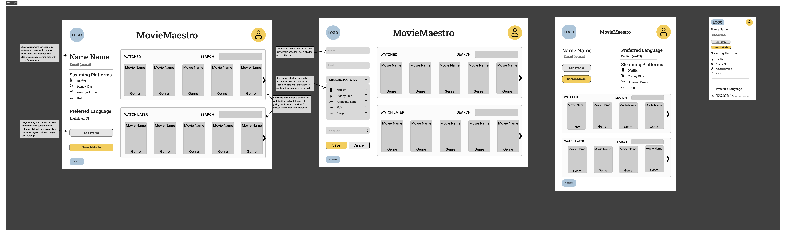
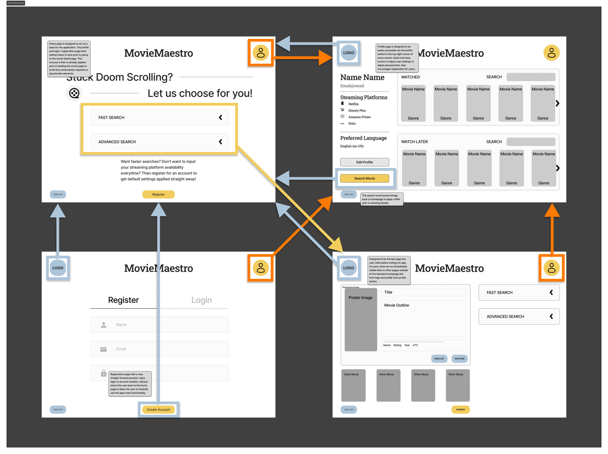
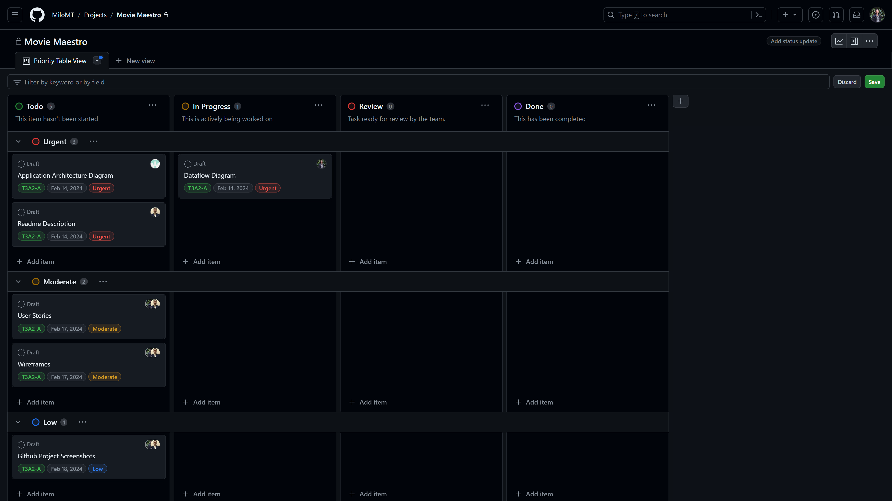
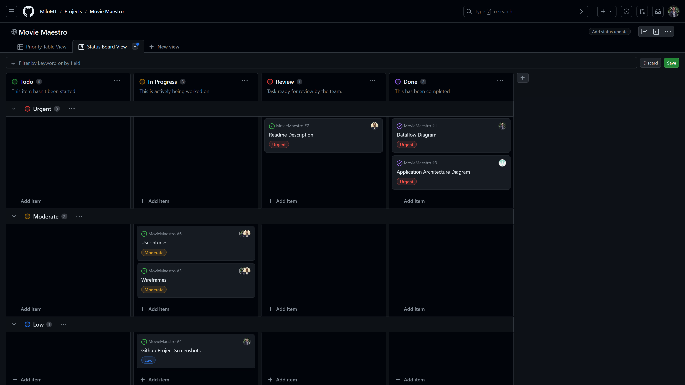
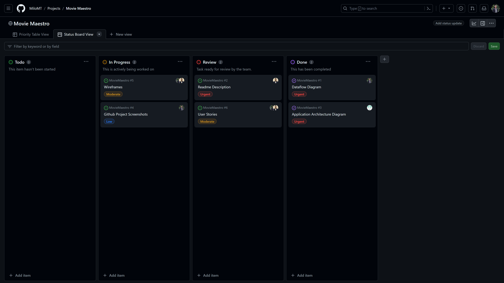
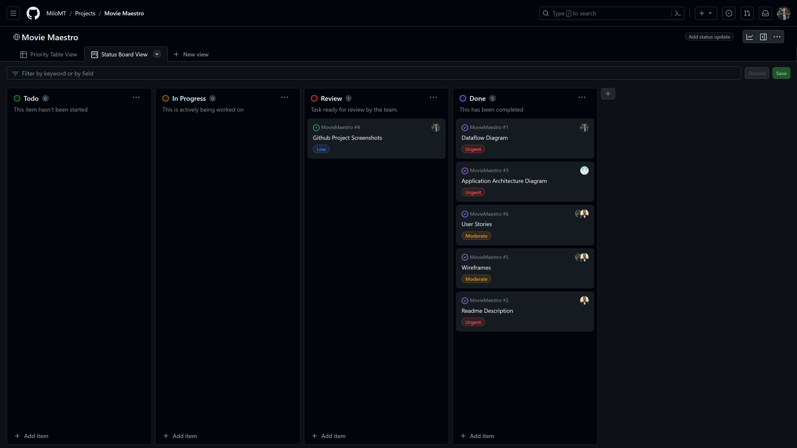

# MovieMaestro

## R1	Description of your website
### Purpose
Do you ever struggle to pick a movie you want to watch? Do you spend hours scrolling through different streaming platforms just to settle on a movie that isn't what you felt like watching? Well say no more! MovieMaestro is an application that saves you time and helps you identify what you want to watch, quickly! By using a variety of Filters, MovieMaestro will select a movie for you to watch so you can go to your streaming platform after and put it straight on! 

The purpose of MovieMaestro is to save you time and get you relaxing and watching the movies you want to watch as soon as possible. By selecting through the many filter options on MovieMaestro, it will direct you to a movie tailored to your wants. This means less time wasted in picking a movie, which means more time for relaxation and entertainment!

### Functionality and Features
- Users can apply filters that will identify a movie to be displayed. This could include but not limited too: genre, streaming service availability, country availability, include/disclude keywords, title, average vote, etc.
- Users can create and register an account on Movie Maestro. They can add user information that will help add defaults to their movie search. For example only requesting movies in their language such as English or Japanese.
- Once the filters have been applied, MovieMaestro will display a movie for the user, the user can choose to accept the movie choice or refresh the search and they can add movies to their "watched list" to exclude it from new searches in the future.
- Registered users can also add movies to a "Watch Later List" which will also show on there profile to save titles for later watching.

### Target Audience
MovieMaestro is designed for people who love movies who often notice themselves having some struggle in selecting a movie from a vast selection available on streaming platforms. It helps people who struggle with indecision when it comes to choosing what to watch and assists in streamlining the process of finding a movie that fits their preferences or mood.

Whether you are a casual viewer looking for a quick movie recommendation or a movie lover seeking a curated suggestion, MovieMaestro aims to simply the movie selection experience. This application is ideal for anyone who values their time and wants to spend more time watching movies and less time picking one to watch! 

### Tech Stack
Our application is created using the MERN stack which consists of:
- MongoDB - A popular database which is document orientated and utilises NoSQL and JSON-like documents as our data.
- Express - A minimalistic Node.js application framework primarily used for routing and middleware(Our backend API).
- React - React is a very powerful Javascript library that allows us to create a dynamic and interactive user-interface(Our Front-end).
- Node.js - Node is a Server-side JavaScript run-time environment it works with Express to enhance functionality of our application by enabling server-side processing.

Other Tech used in our application includes:
- Mongoose
- Vite
- HTML 
- CSS
- Vitest and test-library - Used for our front-end React tests
- SuperTest - Used for our backend, express tests
- Netlify.com - Used for Front-end application hosting
- Render.com - Used for Backend application hosting
- MongoDB.com(Atlas Cloud Service) - Used for Database hosting

## R2	Dataflow Diagram 

## R3	Application Architecture Diagram 

In the frontend, React handles the user interface rendering. HTML, CSS, JavaScript which are fundamental web technologies are used to structure the UI(HTML), style(CSS), and add interactivity(JavaScript).　Netlify is well-suited for hosting frontend applications. So we have chosen Netlify as the hosting service for the frontend.

The front end uses filters and state to construct URLs for fetch requests to the TMDB API which in turn sends back movie details related to the filters that were applied by the user.

Vite helps in the development workflow by fast build times and a modern development experience.

In the backend, Node.js with Express.js handle incoming requests from the frontend. Mongoose can be used to define schemas and models for our MongoDB data. It can facilitate interactions with data stored in MongoDB. Render offers hosting for static and dynamic web applications, along with managed background jobs. So we have chosen Render as the hosting service for the backend.

In the database, MongoDB stores and manage application data, such as user information. Atlas is a fully managed cloud database service for MongoDB. So we have chosen Atlas as the hosting service for the database.

## R4	User Stories 
User stories can help us define features of our application, by creating user stories we can turn our problems into real life examples and use this to implement usable features. As our application will have un-registered and registered users, the needs can be defined differently. The use of the user stories will greatly assist when writing our appliction. They will be used to look back on throughout the process to make sure our features are being implemented in the way we want them and for usability.

We created a group of generic user stories to match our intial proposal and get a firmer understanding of the functionality that we wanted to achieve.

Users:
- As a user, I want to be able to apply filters based on genres, so that I can find movies that match my specific interests.
- As a user, I want to filter movies based on their availability on different streaming platforms, such as Netflix, Amazon Prime, or Hulu, to streamline my viewing options.
- As a user, I want to filter movies based on their availability in different countries, so that I can discover international films that suit my preferences.
- As a user, I want to include or exclude movies based on specific keywords or themes, such as "romantic comedy" or "action-packed", to refine my search results.
- As a user, I want to filter movies based on their average vote ratings, so that I can discover highly-rated films that align with my tastes.

As we discussed the concept of registered users and the ability to login within the interface, we recognised the need to have user stories dedicated to the registered user experience within the application.

Registered Users:
- As a registered user, I want to create and manage my account settings, including language preferences and default filters, to personalize my browsing experience.
- As a registered user, I want to maintain a "watched list" of movies that I've already seen, so that they are excluded from future recommendations and searches.
- As a registered user, I want to be able to save movies that I like the look of so that I can watch them later.

Lastly, during the wireframing process, further functional requires became refined and as such, we wanted to created user stories that related to specific types of users that used the application. These would further our understanding on the types of users that we were designing for.

Specific Users:
- As a parent, I want to filter movies based on appropriation, so that my children can watch appropriate movies.
- As a casual viewer, I want to be able open the application and quickly find a movie without having to sign up.
- As a casual viewer, I want a basic set of filters to get my movie choice faster.
- As a movie aficionado, I want a detailed set of filters to get very specific results.
- As a movie aficionado, I want to be able to save settings to save time when I use the application in the future.

## R5	Wireframes

*Wireframes - Home Page*

*Wireframes - Movie Page*

*Wireframes - Login Page*

*Wireframes - Profile Page*

*Wireframes - Route Relationships*

## R6	Project Planning

For our project we've used Github projects, a kanban style option, to organise our tasks and manage the project. This allows us to apply an agile methodology to our approach and quickly adapt throughout the project development lifecycle. At the start of each phase of the project, intial tasks are discussed, created and assigned within a group discussion to ensure responsibilities are shared and that each team member is aware of the tasks and workload to plan accordingly. As the project develops, tasks are maintained and cards are added / adjusted as required. If cards are no longer needed, ie: the task is considered not planned going forward or time constraints are too severe to finalise prior to deadline, than tasks will be marked as such and not deleted to capture a holistic view of the project cycle. Daily standups will also be held throughout the life cycle of the project to keep team communication and help maintain the project board, ensuring that awareness of tasks is kept high and that development stays on track.

*Progress - 12/02/24*

*Progress - 13/02/24*

*Progress - 14/02/24*

*Progress - 15/02/24*

*Progress - 16/02/24*

